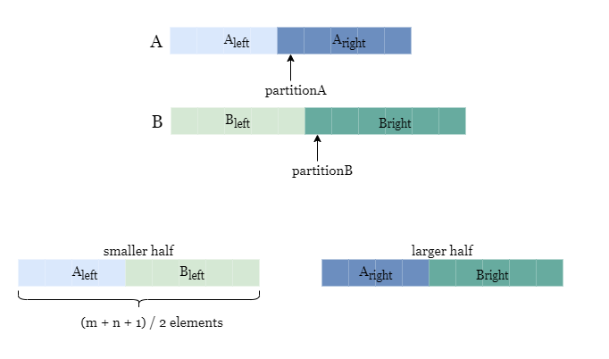
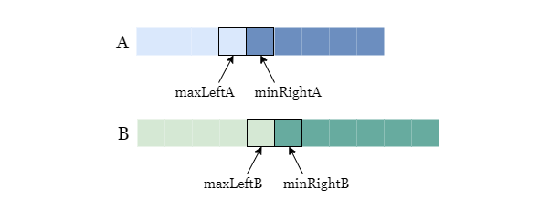
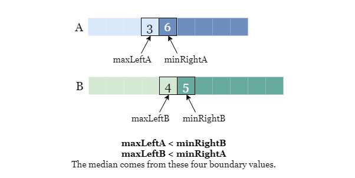
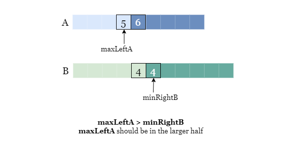
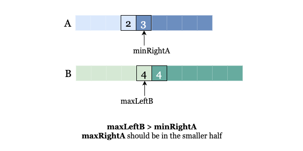

## Шаг 1. Что такое медиана «на пальцах»?

Представь, что у нас есть два отсортированных массива. Мы хотим сложить их в один ящик, но так, чтобы они выстроились по порядку.

Медиана — это строгая граница, которая делит этот ящик ровно на две равные кучи: Левую кучу (где все числа поменьше) и Правую кучу (где все числа побольше).

Главное правило: Если в двух массивах вместе 10 элементов, то в Левой куче обязано оказаться ровно 5 элементов. Не 4, не 6, а строго 5.

## Шаг 2. Осознание: «Мы не ищем число, мы набираем кучу»

Если бы мы объединили массивы, мы бы просто отсчитали 5 элементов слева и провели черту. Но объединять нам запрещено (это долго).

Тогда мы думаем: «Ладно, моя Левая куча должна состоять из каких-то элементов первого массива и каких-то элементов второго массива. Суммарно их должно быть 5».

Отсюда рождается идея вертикального разреза сразу обоих массивов:Если мы решим взять из первого массива 2 элемента, то из второго массива мы вынуждены взять ровно 3 элемента ($2 + 3 = 5$). Мы не можем взять из второго массива 4 элемента, потому что тогда размер Левой кучи станет равен 6, а это нарушит главное правило медианы.

Как только мы выбираем, где провести черту в первом массиве, черта во втором массиве проводится автоматически, сама собой. Они жестко связаны правилом: элементы_слева_1 + элементы_слева_2 = половина.

## Шаг 3. Как понять, что мы угадали с разрезом? 

Допустим, мы ткнули пальцем в небо и провели черту наугад. Из первого массива взяли 2 элемента, из второго — 3.

Внутри каждого массива числа уже идут по возрастанию. То есть в первом массиве всё, что слева от черты, точно меньше того, что справа. Во втором массиве — то же самое. Там порядок идеальный.

Проблема может возникнуть только между массивами. Нам нужно доказать, что вся Левая куча меньше или равна всей Правой куче.

Для этого достаточно проверить только «пограничников» — те числа, которые стоят вплотную к черте:

* Самое большое число из первого массива слева должно быть меньше самого маленького числа из второго массива справа.

* Самое большое число из второго массива слева должно быть меньше самого маленького числа из первого массива справа.

Если эти два условия совпали — ура! Мы нашли истинную медиану.

## Шаг 4. Финальный щелчок: Причем тут Бинарный Поиск?

Мы проверяем наши условия крест-накрест и видим: число слева во втором массиве оказалось БОЛЬШЕ числа справа в первом массиве. (Как в нашем примере с тройкой и двойкой).

Что это значит? Это значит, что во втором массиве слева лежит какая-то «крупная рыба», которой не место в Левой куче меньших чисел. А в первом массиве справа осталось маленькое число, которое мы незаслуженно забыли.

Нам нужно скорректировать разрез:

* Из первого массива нужно взять больше элементов в Левую кучу.
* Из второго массива автоматическая формула возьмет меньше элементов.

И вот тут включается Бинарный поиск!В обычном бинарном поиске мы ищем число: если наше предположение меньше загаданного, мы сдвигаем границу left = mid + 1.

А здесь мы ищем правильное количество элементов, которое нужно взять из первого массива.

* Если мы взяли слишком мало элементов из первого массива (и из-за этого крест-накрест не сошелся), мы говорим: «Мало! Нужно сдвинуть черту в первом массиве вправо» $\rightarrow$ left = mid + 1.

* Если взяли слишком много: «Много! Сдвигаем черту влево» $\rightarrow$ right = mid - 1.

## LeetCode пояснение:

## Интуиция

Вспомним предыдущий подход, в котором мы выполняем бинарный поиск по "объединенному" массиву, состоящему из nums1 и nums2, что приводит к временной сложности O(log(m⋅n)). Мы могли бы еще больше усовершенствовать алгоритм, выполнив бинарный поиск только в меньшем массиве nums1 и nums2, таким образом, временная сложность сократилась до O(log(min(m,n))).

Основная идея аналогична подходу 2, где нам нужно найти точку разбиения в обоих массивах таким образом, чтобы максимум меньшей половины был меньше или равен минимуму большей половины.

Однако вместо разбиения на разделы объединенных массивов мы можем сосредоточиться только на разбиении меньшего массива (назовем этот массив A). Предположим, индекс раздела равен partitionA, мы указываем, что меньшая половина содержит (m + n + 1) / 2 элемента, и мы можем использовать эту функцию в наших интересах, напрямую установив partitionB равным (m + n + 1) / 2 - partitionA, таким образом, меньшие половины обоих массивов всегда будут одинаковыми. содержат в общей сложности (m + n + 1) / 2 элемента, как показано на рисунке ниже.

Следующим шагом будет сравнение этих краевых элементов.

Если значения maxLeftA <= minRightB и maxLeftB <= minRightA совпадают, это означает, что мы разделили массивы на разделы в правильном месте.

* Меньшая половина состоит из двух разделов A_left и B_left

* Большая половина состоит из двух разделов A_right и B_right

Нам просто нужно найти максимальное значение из меньшей половины как max(A[maxLeftA], B[maxLeftB]) и минимальное значение из большей половины как min(A[minRightA], B[minRightB]). Среднее значение зависит от этих четырех граничных значений и общей длины входных массивов, и мы можем вычислить его в зависимости от ситуации.

Если maxLeftA > minRightB, это означает, что значение maxLeftA слишком велико, чтобы находиться в меньшей половине, и нам следует искать меньшее значение раздела A.

В противном случае это означает, что значение minRightA слишком мало, чтобы быть в большей половине, и нам следует искать большее значение раздела A.

Алгоритм

1. Предполагая, что nums1 - это меньший массив (если nums2 меньше, мы можем поменять их местами). Пусть m, n представляют размер nums1 и nums2 соответственно.

2. Определите область поиска для индекса секционирования partitionA, установив границы слева = 0 и справа = m.

3. При сохранении значения left <= right выполните следующие действия.

4. Вычислите индекс разбиения nums1 как partitionA = (left + right) / 2. Следовательно, индекс разбиения nums2 равен (m + n + 1) / 2 - partitionA.

5. Получите граничные элементы:
    * Определите максимальное значение параметра A_left как maxLeftA = nums1[partitionA - 1]. Если partitionA - 1 < 0, задайте его как maxLeftA = float(-inf).
    
    * Определите минимальное значение параметра section A_right как minRightA = nums1[partitionA]. Если partitionA >= m, задайте его как minRightA = float(inf).
    
    * Определите максимальное значение параметра B_left раздела как maxLeftB = nums2[Раздел B - 1]. Если раздел B - 1 < 0, задайте его как maxLeftB = float(-inf).
    
    * Определите максимальное значение параметра B_right как minRightB = nums2[partitionB]. Если partitionB >= n, задайте его как minRightB = float(inf).

6. Сравните и пересчитайте: сравните maxLeftA с minRightB и maxLeftB с minRightA.
    
    * Если значение maxLeftA > minRightB, это означает, что значение maxLeftA слишком велико, чтобы находиться в меньшей половине, поэтому мы обновляем значение right = partitionA - 1, чтобы переместиться в левую половину области поиска.
    
    * Если maxLeftB > minRightA, это означает, что мы находимся слишком далеко слева для partitionA, и нам нужно перейти к правой половине области поиска, обновив left = partitionA + 1.

   Повторите шаг 4.

7. Когда оба значения maxLeftA <= minRightB и maxLeftB <= minRightA равны true:
    
    * Если (m + n) % 2 = 0, медианное значение - это среднее значение максимального значения меньшей половины и минимального значения большей половины, заданное параметром answer = (max(maxLeftA, maxLeftB) + min(minRightA, minRightB)) / 2.
    
    * В противном случае медианным значением является максимальное значение меньшей половины, заданное параметром answer = max(maxLeftA, maxLeftB).
